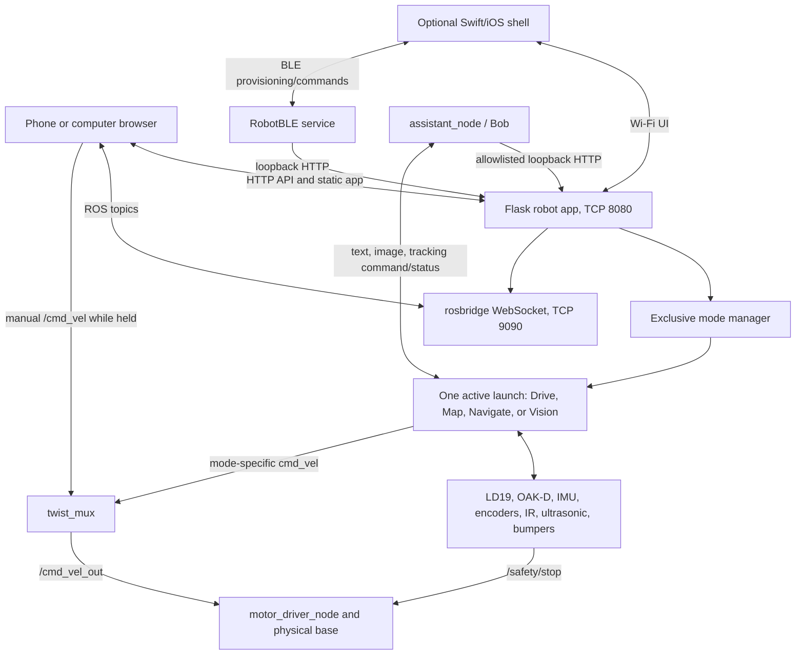
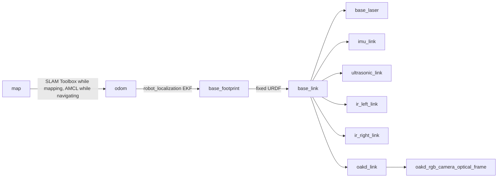

# ROS Nodes, Services, Topics, and Data Flow

[Start here](START_HERE.md) |
[Recommissioning manual](RECOMMISSIONING_MANUAL.md) |
[Wiring](WIRING_AND_POWER.md) |
[File guide](FILE_GUIDE.md)

This reference describes the project-owned processes and the external ROS 2
nodes started by the launch files. Names and topics are taken from the archived
source. Use `ros2 node list`, `ros2 topic list -t`, and `ros2 node info NAME` on
the recommissioned robot to verify the live graph.

## System architecture

The Flask server owns at most one robot-mode process group. It sends SIGINT,
then SIGTERM, then SIGKILL only to the group it created. Rosbridge remains
separate so the UI and assistant can stay connected while motion is stopped.

## Command arbitration

`twist_mux` accepts unstamped `geometry_msgs/Twist` commands. A source wins only
while publishing within its configured 0.5-second timeout.

| Priority | Source | Topic | Used by |
| ---: | --- | --- | --- |
| 100 | manual teleop | `/cmd_vel` | web Drive controls or another teleop publisher |
| 60 | person tracking | `/cmd_vel/tracking` | production follower after launch remapping |
| 50 | Nav2 | `/cmd_vel/navigation` | controller and behavior servers |
| 40 | mapping | `/cmd_vel/mapping` | wall follower |

The mux publishes `/cmd_vel_out`. `motor_driver_node` stops after 0.6 seconds
without a fresh command and also consumes `/safety/stop` directly.

## Project-owned ROS nodes

### `motor_driver_node`

- File: `my_robot_package/motor_driver_node.py`
- Inputs: selected Twist (normally `/cmd_vel_out`), `/safety/stop` (`Bool`),
  `/odom` (`Odometry`).
- Outputs: physical left/right signed PWM via L298N input pins.
- Behavior: converts linear/angular velocity to differential wheel targets,
  scales both to the configured maximum, and applies open-loop feed-forward PWM.
- Safety: 0.6-second command watchdog; immediate software stop on safety Bool;
  closes GPIO and stops motors on shutdown.
- Closed loop: encoder PI exists but requires both
  `closed_loop_enabled: true` and `wheel_calibration_confirmed: true`.

### `encoder_odom_node`

- File: `my_robot_package/encoder_odom_node.py`
- Inputs: two quadrature channels per wheel from GPIO.
- Output: `/odom` (`nav_msgs/Odometry`) at 30 Hz by default.
- Optional TF: `odom -> base_footprint`; full launches set `publish_tf: false`
  because `robot_localization` owns that transform.
- Calibration defaults: 494 ticks/rev, 0.060 m wheel diameter, 0.240 m wheel
  separation, left direction `-1`, right direction `+1`. They are provisional.

### `imu_node`

- File: `my_robot_package/imu_node.py`
- Hardware: MPU6050/GY-521 on I2C bus 1, address `0x68`.
- Output: `/imu/data` (`sensor_msgs/Imu`) at 50 Hz.
- Provides acceleration and angular velocity; orientation is explicitly unknown.
- Gyro offsets are stored in `config/hardware_calibration.yaml` and must be
  re-measured with the robot still and level.

### `ultra_sensor_node`

- File: `my_robot_package/ultra_sensor_node.py`
- Hardware: HC-SR04, BCM20 TRIG and level-shifted BCM21 ECHO.
- Output: `/ultrasonic_distance` (`sensor_msgs/Range`) at 10 Hz.
- Range: 0.02 to 2.0 m; readings near maximum publish infinity.

### `ir_sensor_node`

- File/executable: `my_robot_package/ir_driver.py` / `ir_driver`.
- Hardware: left FC-51 on BCM16 and right FC-51 on BCM26.
- Outputs: `/ir/left` and `/ir/right` (`sensor_msgs/Range`) at 10 Hz.
- Digital blocked state becomes 0.05 m; clear becomes infinity. It is not a true
  metric distance sensor.
- Known archive condition: left sensor was asserted in open space. Tracking has
  temporary degraded logic requiring both IR channels to agree. Repair this.

### `bumper_node`

- File: `my_robot_package/bumper_node.py`
- Hardware: left/center/right normally-open switches on BCM9/11/10 with pull-ups.
- Outputs: `/safety/stop` (`std_msgs/Bool`) continuously at 20 Hz and
  `/bumper_cloud` (`sensor_msgs/PointCloud2`) while contact is present.
- Contact points are provisional: center `(0.16, 0)`, left `(0.15, 0.10)`, right
  `(0.15, -0.10)` in `base_footprint`.
- On shutdown it attempts to publish `true` before closing GPIO.

### `wall_follower`

- File: `my_robot_package/wall_follower.py`.
- Inputs: `/scan`, `/ir/left`, `/ir/right`, `/ultrasonic_distance`, `/odom`, and
  direct GPIO ownership of all three bumper switches.
- Output: remapped from `/cmd_vel` to `/cmd_vel/mapping` in mapping mode.
- Behavior: seek a wall, keep roughly 0.20-0.30 m from the right side, avoid
  front/near-field obstacles, and stop after returning near the start following
  at least five minutes and a 2.5 m departure.
- Important: it performs a reverse/turn escape after contact. Run only in the
  legacy mapping launch and only after restrained validation.

### `person_follower_node`

- File: `my_robot_package/person_follower_node.py`.
- Runtime: exactly DepthAI `2.32.0.0` in `.venv-depthai2`; the node verifies the
  version, neural-network blob path, and optional SHA-256 before opening OAK-D.
- Pipeline: RGB 1080p camera with 300x300 preview, stereo 480p depth,
  MobileNet spatial person detector, and short-term image-less object tracker.
- Commands: `/tracking/command` and compatibility `/assistant/command`, both
  `std_msgs/String`.
- Sensor inputs: `/scan`, `/ultrasonic_distance`, `/ir/left`, `/ir/right`,
  `/bumper_cloud`, `/safety/stop`.
- Outputs: `/cmd_vel` (launch remaps it to `/cmd_vel/tracking`),
  `/oakd/color/image_raw`, `/tracking/status`, `/tracking/event`, and optional
  `/oakd/depth/points`.
- Modes: `IDLE`, `FOLLOW`, `KEEP_FRAME`.
- Media commands: `take_photo`, `start_recording`, `stop_recording`; default
  destination `~/robot_recordings`, 15 FPS, ten-minute maximum, and 512 MB
  minimum free space.
- Identity aid: local HSV clothing-color signature in
  `~/.config/mapping-robot/target_enrollment.json`. It is not facial recognition
  or biometric proof. Motion requires an enrollment by default.
- Fail-closed gates: target freshness, depth validity, required sensor
  heartbeats, obstacle distances, bumper state, undervoltage/throttling,
  Raspberry Pi and OAK temperature, and `motion_enabled`.
- Optional point cloud requires both measured OAK-D extrinsics and a passed
  benchmark, except in the explicit motor-free benchmark mode.

### `assistant_node`

- File: `my_robot_package/assistant_node.py`; pure command mapping lives in
  `assistant_logic.py`.
- Node name: `assistant_node`; persona name: Bob.
- Required secret: `OPENAI_API_KEY` from the process environment. Default model
  is `gpt-4o`, overridable with `OPENAI_MODEL` or ROS parameter `openai_model`.
- Audio input: `speech_recognition` microphone, default 16 kHz; listens in a
  background thread for the wake phrase "Hi Bob".
- Audio output: OpenAI speech streaming to `mpg123`; service startup bridges to
  the logged-in user's PipeWire/Pulse session.
- Camera input: latest `/oakd/color/image_raw`; stale/no image causes a clear
  failure instead of a fabricated visual answer.
- Text app input/output: `/assistant/text_query` and
  `/assistant/text_response`, JSON carrying a request ID and text.
- Compatibility output: `/assistant/command`.
- Tools: web search, visual-scene analysis, robot mode selection, named-room
  navigation, and optional shell execution.
- Robot actions call allowlisted endpoints on `http://127.0.0.1:8080`, ensuring
  mode exclusivity. General AI-generated shell execution is disabled by the
  startup script and systemd service.
- Internet is required for model, speech, and web-search features.

### Diagnostics and bounded tests

| Process | Purpose | Motors |
| --- | --- | --- |
| `check_vision` | minimal DepthAI camera-open smoke test | never starts motors |
| `oakd_ai_test` | small DepthAI AI/model experiment | never starts motors |
| `calibration_check` | validates consistency of hardware/status YAML | never starts motors |
| `perception_benchmark` | measures OAK point-cloud/LD19 rates and Pi temperature | never starts motors |
| `depthai2_floor_follow_test_node` | one bounded, separately armed floor test on `/depthai2_test/*` | only when launch receives `enable_motion:=true` |

The floor-test controller is intentionally absent from `setup.py` console
scripts and is started as a module through its isolated DepthAI 2 interpreter.
It requires one publisher on its private motor topic, one safety-stop publisher,
fresh scan/odom/bumper data, and an explicit `/depthai2_test/arm` trigger.

## External nodes launched by this repository

| Node/process | Role | Main interfaces |
| --- | --- | --- |
| `LD19` | LiDAR driver | publishes `/scan`, frame `base_laser` |
| `robot_state_publisher` | fixed transforms from URDF | publishes `/tf_static` |
| `twist_mux` | command priority arbitration | mode command topics to `/cmd_vel_out` |
| `ekf_filter_node` | encoder/IMU fusion | reads `/odom`, `/imu/data`; owns `odom -> base_footprint` TF |
| SLAM Toolbox | online asynchronous mapping | reads `/scan` and TF; publishes `/map` and `map -> odom` |
| `foxglove_bridge` | remote ROS diagnostics | TCP 8765 |
| `controller_server` | Nav2 local control | publishes `/cmd_vel/navigation` |
| `planner_server` | Nav2 global path planning | planner services/actions |
| `behavior_server` | Nav2 recovery behaviors | may publish `/cmd_vel/navigation` |
| `bt_navigator` | NavigateToPose behavior tree | `/navigate_to_pose` action |
| `map_server` | serves selected map YAML/PGM | `/map` |
| `amcl` | saved-map localization | reads `/scan`; owns `map -> odom` TF |
| lifecycle managers | configure/activate Nav2 nodes | lifecycle services |
| `explore_node` | optional frontier selection | sends Nav2 goals while SLAM runs |
| `rosbridge_websocket` | browser ROS transport | TCP 9090 |

## Transform contract

The current URDF dimensions and OAK-D transform are approximate. Re-measure
them before using camera depth or autonomous navigation.

## Topic contract

| Topic | Type | Primary publisher | Primary consumers |
| --- | --- | --- | --- |
| `/scan` | `sensor_msgs/LaserScan` | LD19 | SLAM, AMCL, Nav2 costmaps, wall follower, tracker |
| `/odom` | `nav_msgs/Odometry` | encoder odometry | EKF, Nav2, motor feedback, wall follower |
| `/imu/data` | `sensor_msgs/Imu` | IMU node | EKF |
| `/ir/left`, `/ir/right` | `sensor_msgs/Range` | IR node | Nav2, wall follower, tracker |
| `/ultrasonic_distance` | `sensor_msgs/Range` | ultrasonic node | Nav2, wall follower, tracker |
| `/bumper_cloud` | `sensor_msgs/PointCloud2` | bumper node | Nav2 costmaps, tracker |
| `/safety/stop` | `std_msgs/Bool` | bumper node | motor driver, tracker, test controller |
| `/cmd_vel` | `geometry_msgs/Twist` | web teleop | twist mux |
| `/cmd_vel/mapping` | `geometry_msgs/Twist` | wall follower | twist mux |
| `/cmd_vel/navigation` | `geometry_msgs/Twist` | Nav2 | twist mux |
| `/cmd_vel/tracking` | `geometry_msgs/Twist` | remapped follower | twist mux |
| `/cmd_vel_out` | `geometry_msgs/Twist` | twist mux | motor driver |
| `/tracking/command` | `std_msgs/String` | web server via ROS CLI | tracker |
| `/tracking/status` | `std_msgs/String` JSON | tracker | web UI |
| `/tracking/event` | `std_msgs/String` | tracker | web UI |
| `/oakd/color/image_raw` | `sensor_msgs/Image` | tracker/perception | assistant, diagnostics |
| `/oakd/depth/points` | `sensor_msgs/PointCloud2` | optional tracker | Nav2 costmaps, benchmark |
| `/assistant/text_query` | `std_msgs/String` JSON | web UI | assistant |
| `/assistant/text_response` | `std_msgs/String` JSON | assistant | web UI |
| `/initialpose` | `PoseWithCovarianceStamped` | web UI | AMCL |
| `/navigate_to_pose` | Nav2 action | web server/clients | `bt_navigator` |

## Nodes by operating mode

### Stopped/UI-only

`robot_web_server.py`, `rosbridge_websocket`, optional BLE service, and the
separate assistant service. No motor GPIO node starts until a mode is selected.

### Drive

`twist_mux`, `motor_driver_node`, `encoder_odom_node`, `bumper_node`.

### Mapping, legacy wall follower

Robot state publisher, LD19, twist mux, motor, encoder, IMU, EKF, Foxglove,
SLAM Toolbox, ultrasonic, IR, and `wall_follower`. `bumper_node` is absent
because `wall_follower` owns the switches directly.

### Mapping, frontier exploration

Same hardware/SLAM stack, but `bumper_node` replaces `wall_follower`; Nav2
controller/planner/behavior/BT/lifecycle nodes plus `explore_node` are added.
Launch is blocked until required calibration flags are true.

### Saved-map navigation

Robot state publisher, LD19, twist mux, motor, encoder, IMU, EKF, ultrasonic,
IR, bumper, Foxglove, map server, AMCL, Nav2 controller/planner/behavior/BT and
lifecycle manager. Optional OAK-D perception remains motion-disabled.

### Vision/person tracking

Robot state publisher, LD19, twist mux, motor, encoder, ultrasonic, IR, bumper,
and the isolated DepthAI 2 follower. Foxglove and the assistant are optional.
Tracking starts in `IDLE`; enrollment and explicit follow/framing commands are
required before motion.

## UI and local process services

### Flask robot app

- Service: `robot_web.service`
- Static/UI and HTTP API: TCP `8080`, bound to `0.0.0.0` by default.
- Rosbridge: TCP `9090`, started as a child process at app startup.
- Data: maps under the package `maps/`; rooms under
  `~/.config/mapping-robot/rooms.json`; enrollment under the adjacent JSON file.
- Main endpoints: status, maps, rooms, mode start, tracking command, navigation
  goal, map save, stop, IMU check, Wi-Fi, reboot, shutdown, and suspend.
- Power actions stop the managed robot mode, wait three seconds, then call a
  fixed `systemctl` command.

### BLE provisioning

- Service: `robot_ble.service`; advertised name `RobotBLE`.
- Provides Wi-Fi scan/configuration, current WLAN IPv4 address, and a small
  allowlist of mode commands.
- Mode commands are forwarded to the loopback Flask API rather than launching
  ROS independently.
- BLE characteristics are unauthenticated in the archived implementation.

### Browser app

- `index.html` + `style.css` render the installable web app.
- `main.js` calls the Flask API, connects to `ws://ROBOT:9090`, publishes held
  manual-drive commands, subscribes to tracking/assistant status, renders maps,
  sets AMCL initial pose, queues navigation goals, and edits named rooms.
- `manifest.webmanifest`, `service-worker.js`, and `bob-icon.svg` provide PWA
  metadata. Pinned ROSLib/ROS2D dependencies are still loaded from CDNs, so the
  interface is not fully offline.
- Swift files are reference components for an iOS wrapper, not a complete
  Xcode project. `MapWebView.swift` embeds `http://ROBOT_IP:8080`.

## Network exposure

| Port/interface | Purpose | Authentication in archive |
| --- | --- | --- |
| TCP 22 | SSH administration | SSH key/password managed by Linux |
| TCP 8080 | web UI and control API | none |
| TCP 9090 | rosbridge WebSocket | none |
| TCP 8765 | Foxglove in mapping/navigation or optional tracking | none at launch |
| BLE `RobotBLE` | Wi-Fi and node commands | none |

Use only on a trusted private LAN or behind a VPN/firewall. Never forward 8080,
9090, or 8765 from the public internet.
