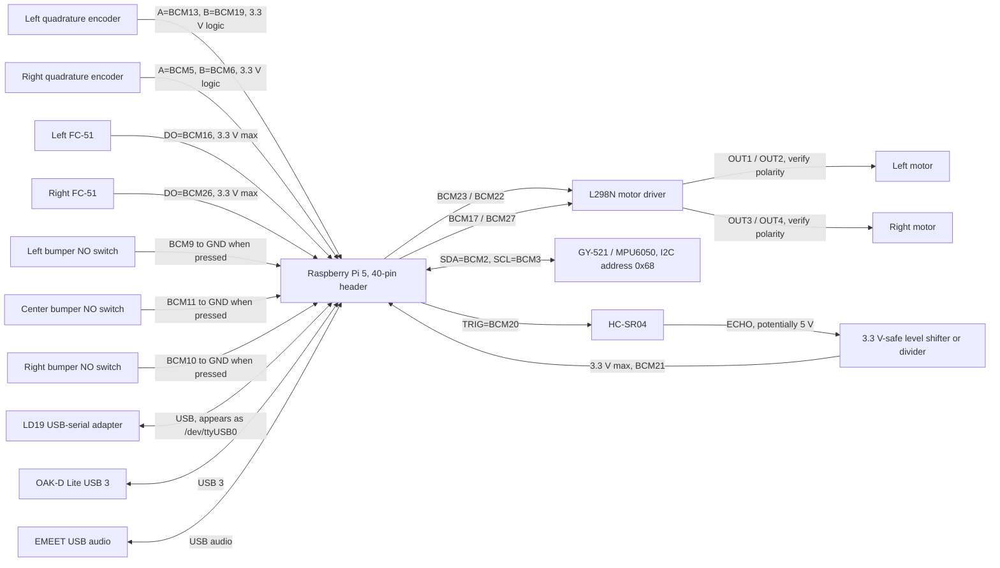
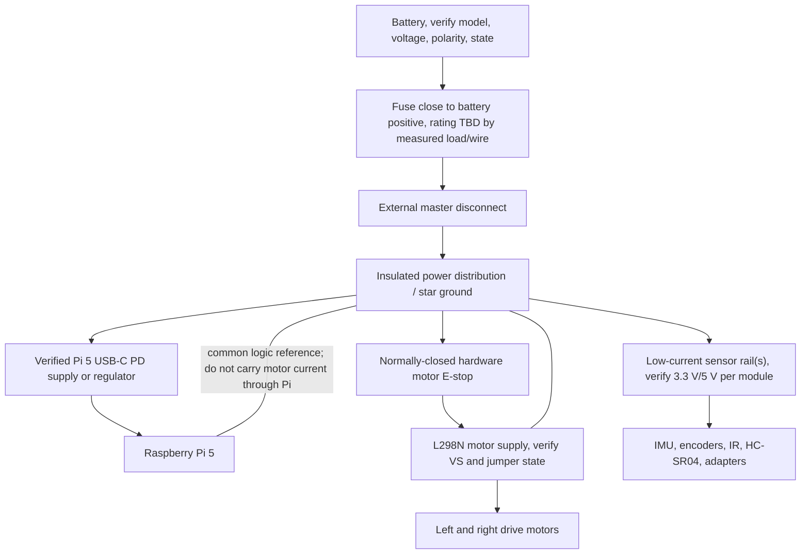

# Bob Wiring and Power Reference

Status: archived from source on 2026-09-09. GPIO assignments and software
interfaces below are exact defaults from the repository. The power distribution
is a recommended verification topology because the as-built terminal order,
wire gauge, fuse rating, regulator model, connector polarity, and L298N jumper
state are not recorded. Do not energize the robot until those facts are traced
and written onto a physical wiring label.

## Safety rules

1. Disconnect the battery before measuring resistance, continuity, or connector
   pinout. Never probe an energized battery connector in resistance mode.
2. Raise and restrain the drive wheels for first power and every GPIO/motor test.
3. Put a correctly rated fuse close to battery positive and an externally
   reachable hardware motor-power disconnect/E-stop before floor operation.
4. All Raspberry Pi GPIO is 3.3 V logic and is not 5 V tolerant.
5. The HC-SR04 ECHO line can be 5 V. It must pass through a verified divider or
   level shifter before Raspberry Pi GPIO21.
6. Verify the FC-51 and motor-encoder output levels are no more than 3.3 V at the
   Pi pins. Add level shifting if their supply makes the outputs 5 V.
7. Logic grounds must share a reference, but high-current motor return wiring
   should not be routed through the Pi. Use a star/common-ground arrangement at
   the distribution point and keep motor wiring away from I2C/encoder signals.
8. The physical cutoff is the only stop independent of Linux, ROS, and software.

## Pin numbering convention

The software uses Broadcom GPIO numbers (`BCM`), not physical header numbers.
The physical pin column below is for a standard Raspberry Pi 40-pin header.

## Exact Raspberry Pi signal map

| Function | Device terminal | BCM GPIO | Physical pin | Direction at Pi | Software owner |
| --- | --- | ---: | ---: | --- | --- |
| Left motor forward | L298N left IN1 | 23 | 16 | output/PWM | `motor_driver_node` |
| Left motor reverse | L298N left IN2 | 22 | 15 | output/PWM | `motor_driver_node` |
| Right motor forward | L298N right IN1 | 17 | 11 | output/PWM | `motor_driver_node` |
| Right motor reverse | L298N right IN2 | 27 | 13 | output/PWM | `motor_driver_node` |
| Left encoder A | left encoder A | 13 | 33 | input | `encoder_odom_node` |
| Left encoder B | left encoder B | 19 | 35 | input | `encoder_odom_node` |
| Right encoder A | right encoder A | 5 | 29 | input | `encoder_odom_node` |
| Right encoder B | right encoder B | 6 | 31 | input | `encoder_odom_node` |
| Left IR digital output | left FC-51 DO | 16 | 36 | input | `ir_sensor_node` |
| Right IR digital output | right FC-51 DO | 26 | 37 | input | `ir_sensor_node` |
| Ultrasonic trigger | HC-SR04 TRIG | 20 | 38 | output | `ultra_sensor_node` |
| Ultrasonic echo | HC-SR04 ECHO through level shifter | 21 | 40 | input | `ultra_sensor_node` |
| Left bumper | normally-open switch to GND | 9 | 21 | input, pull-up | `bumper_node` or `wall_follower` |
| Center bumper | normally-open switch to GND | 11 | 23 | input, pull-up | `bumper_node` or `wall_follower` |
| Right bumper | normally-open switch to GND | 10 | 19 | input, pull-up | `bumper_node` or `wall_follower` |
| IMU SDA | GY-521/MPU6050 SDA | 2 | 3 | I2C data | `imu_node` |
| IMU SCL | GY-521/MPU6050 SCL | 3 | 5 | I2C clock | `imu_node` |

Use any convenient Pi ground pins, but record the exact choice on the as-built
label. Common ground pins include physical 6, 9, 14, 20, 25, 30, 34, and 39.
The repository does not record which one is used for each device.

### Critical GPIO ownership rule

`wall_follower` and `bumper_node` both open BCM 9/11/10. Never run both at the
same time. The mapping launch enforces this: legacy wall-follow mapping launches
`wall_follower` only; frontier mapping launches `bumper_node` only. Manual,
navigation, and tracking use `bumper_node`.

## USB and serial connections

| Device | Connection | Runtime expectation | Check |
| --- | --- | --- | --- |
| LD19 LiDAR | LD19 adapter to Pi USB/serial | `/dev/ttyUSB0`, 230400 baud | `ls -l /dev/ttyUSB0`; `ros2 topic hz /scan` |
| OAK-D Lite | USB 3 data/power to Pi | DepthAI 2.32 for production tracking | `lsusb`; run motor-free Vision first |
| EMEET M0 Plus | USB audio to Pi | PipeWire/Pulse user session, 16 kHz default input | `arecord -l`; assistant service logs |
| Pi storage | microSD or SSD | contains OS, ROS workspace, user state | check filesystem and free space |

The LD19 device name can change if another USB serial device is attached first.
If it is not `/dev/ttyUSB0`, create a persistent udev symlink and update
`src/my_robot_package/launch/ld19.launch.py` and the isolated floor-test launch.

## Exact signal circuit

## Provisional power topology to verify

This diagram is not a claim about the current build. It is the minimum safe
topology to trace and label before recommissioning. The battery seed in CAD is a
TalentCell PB030201-35 and the motor seed is a 12 V JGA25-371, but model numbers,
connector polarity, output ratings, and actual hardware must be checked directly.

### L298N checks

- The code drives only four direction inputs; it does not define separate ENA or
  ENB GPIO. Determine whether ENA/ENB are jumper-enabled or wired elsewhere.
- Identify which terminals are `VS`, logic supply, GND, OUT1/OUT2, and OUT3/OUT4
  from the exact board silkscreen/datasheet. Clone layouts differ.
- Confirm that a positive command turns both wheels forward. Software currently
  uses left encoder direction `-1` and right encoder direction `+1`.
- Do not use the L298N regulator as the Pi 5 supply unless its exact capability
  has been independently validated; the repository assumes a separate Pi PD
  board in the CAD layout.

### HC-SR04 level shifting

A common resistor-divider example is 1 kOhm from ECHO to Pi input and 2 kOhm
from Pi input to ground, producing roughly 3.3 V from a 5 V ECHO. Component
values and actual output must be measured. A proper unidirectional level
shifter is also acceptable. The TRIG signal goes directly from BCM20 only if the
module reliably recognizes 3.3 V as high.

### Bumper circuit

Each switch is configured with the Pi's internal pull-up. Wire one terminal to
its assigned GPIO and the other to GND. Released reads high; pressed reads low.
Use normally-open contacts. Confirm mechanical release and debounce behavior
before installing motor power.

## Connector-label scheme

Label both ends of every cable with the same ID:

| ID | Circuit |
| --- | --- |
| `PWR-BAT` | battery output to fuse/disconnect |
| `PWR-PI` | regulated Pi USB-C/PD power |
| `PWR-MOT` | motor supply after hardware E-stop |
| `M-L` / `M-R` | left/right motor output pair |
| `ENC-L` / `ENC-R` | encoder power, ground, A, B |
| `IMU-I2C` | 3.3 V, GND, SDA, SCL |
| `US-FRONT` | HC-SR04 power, GND, TRIG, shifted ECHO |
| `IR-L` / `IR-R` | IR power, GND, digital output |
| `BUM-L/C/R` | bumper GPIO and GND |
| `USB-LD19` | LiDAR adapter USB |
| `USB-OAK` | OAK-D Lite USB 3 |
| `USB-MIC` | EMEET USB audio |

Photograph every labeled connection before closing the chassis. Store the
photos outside Git if they reveal home/network details, and record their archive
location in the private credential record.

## Unpowered continuity checklist

- [ ] Battery disconnected and charger removed.
- [ ] No short between positive and ground on each unpowered rail.
- [ ] Fuse value, wire gauge, and connector current rating recorded.
- [ ] Battery and every DC connector polarity marked at both ends.
- [ ] Hardware E-stop opens motor positive while leaving no alternate feed.
- [ ] Pi GPIO pins have no continuity to a 5 V signal source.
- [ ] HC-SR04 ECHO level shifter/divider verified.
- [ ] Encoder and FC-51 output voltage verified at their actual supply voltage.
- [ ] All grounds share a reference; motor current bypasses Pi ground wiring.
- [ ] Motor pairs and encoder channels match left/right labels.
- [ ] Bumper switch release and travel are free and repeatable.
- [ ] USB cables have strain relief and do not carry mast loads.

## First-power order

1. Leave motor supply physically disconnected. Power only the regulated Pi.
2. Verify no undervoltage/throttling with `vcgencmd get_throttled` and inspect
   `journalctl -b -p warning`.
3. Verify I2C with `i2cdetect -y 1`; expect `68` for the MPU6050.
4. Verify GPIO inputs without motors: encoders, IR, and each bumper.
5. Connect LD19 and confirm `/scan`; connect OAK-D and run only a motor-free
   camera test.
6. With wheels raised and a spotter at the cutoff, connect motor power. Start
   manual mode, issue very short low-speed commands, verify direction, release,
   watchdog stop, bumper stop, then physical cutoff.
7. Do not place the robot on the floor until every gate in the main manual and
   `config/calibration_status.yaml` is complete.

## Source-of-truth files

- GPIO and PWM: `src/my_robot_package/my_robot_package/motor_driver_node.py`
- Encoder pins/geometry: `src/my_robot_package/my_robot_package/encoder_odom_node.py`
- IMU bus/address: `src/my_robot_package/my_robot_package/imu_node.py`
- IR pins: `src/my_robot_package/my_robot_package/ir_driver.py`
- Ultrasonic pins: `src/my_robot_package/my_robot_package/ultra_sensor_node.py`
- Bumper pins: `src/my_robot_package/my_robot_package/bumper_node.py`
- Central runtime overrides: `src/my_robot_package/config/hardware_calibration.yaml`
- LiDAR port: `src/my_robot_package/launch/ld19.launch.py`
- Sensor transforms: `src/my_robot_package/urdf/my_robot.urdf`
- Mechanical measurement workbook, local CAD archive only:
  `cad/chassis_v2/MEASUREMENTS.md`

If the wiring and source disagree, stop. Trace the as-built robot, update the
source and this table together, rebuild, and repeat the raised-wheel tests.
